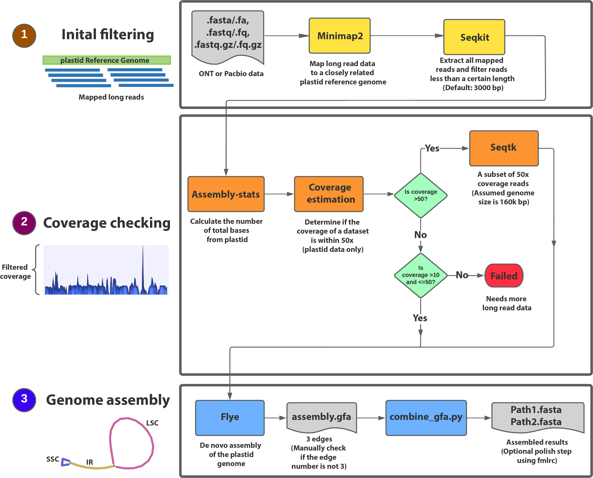

# PlasTid Genome Assembly Using Long reads data (ptGAUL)
```
===========================================================================
                       _____           _        _         _    _
    ___      _       /  ___  \       / _ \     | |       | |  | |
   / _ \    | |     / /     \ \     / / \ \    | |       | |  | |
  / / \ \ __| |__  | |       \_|    / / \ \    | |       | |  | |
  ||   |||__   __| | |             / / _ \ \   | |       | |  | |
  | \_/ /   | |    | |      ___    /  ___  \   | |       | |  | |
  |  __/    | |_   | |     |__ |  / /     \ \  \ \       / /  | |        _
  | |       |   |   \ \ ___ / /   / /     \ \   \ \ ___ / /   | | _____ | |
  |_|       |__/     \ _____ /   /_/       \_\   \ _____ /    | _________ |

===========================================================================
```
This pipeline is used for plastid (chloroplast) genome assembly based on long read data, including both Nanopore and PacBio. It will help assemble the complex plastomes with many long repeat regions and reduce the assembly path number from short reads data. Our data is in prep. [Zhou et al. (unpublished)]. We introduced this pipeline in [BAGGs workshop](https://tarheels.live/baags/) at UNC.

## Installation
Create a conda environment
```
conda create --name chloroplast python=3.7
source activate chloroplast
```

[Use conda to install](https://anaconda.org/bioconda/ptgaul).
```
conda install -c bioconda ptgaul
ptGAUL.sh -h
```

## Environment
Examples can be run on Linux and Mac.



## Quick run
The basic arguments in ptGAUL.sh are 1) -r: a plastome from a closely related species and 2) -l: your long read data (any seuquence file in fasta, fastq, and fq.gz format).

### keep in mind, run the command in the ptGAUL_version directory. Otherwise, combine_gfa.py will not be able to run automatically.
  
  ```
  ptGAUL.sh -r [PATH]/[reference_genome]/ -l [PATH]/[long_read_data]
  ```

#### EXAMPLE
##### The command for the example data.
  ```bash
  ptGAUL.sh -r /path/Beta.fasta -l /path/SRR1980665.1 -t 8 -f 3000 -o ./ptgaul/
  ```

  To check all parameters in ptGAUL using:
  ```bash
  ptGAUL.sh -h
  ```
  
##### Parameters in details
```bash
Usage: ptGAUL.sh -r (REFERENCE FILE) -l (LONG READ FILE)

                 [-t threads int] [-g genome size int]
                 [-c coverage int] [-f filter threshold int]
                 [-o output directory string]

this pipeline is used for plastome assembly using long read data.

optional arguments:
-h, --help            <show this help message and exit>
-r, --reference       <MANDATORY: reference contigs or scaffolds in fasta format>
-l, --longreads       <MANDATORY: raw long reads in fasta/fastq/fq.gz format>
-t, --threads         <number of threads, default:1>
-g, --genomesize      <expected genome size of plastome (bp), default:160000>
-c, --coverage        <a rough coverage of data used for plastome assembly, default:50>
-f, --filtered        <the raw long reads will be filtered if the lengths are less than this number (bp); default: 3000>
-o, --outputdir       <output directory of results, defult is current directory>

```

## Check your results before using it
If the edge number does not equal 1 or 3 with abnormal plastid length, You should manually check the assembled data using [BANDAGE](https://rrwick.github.io/Bandage/). When you confirm the edges are three, you can manually run the python script again to get the assembly results including two paths.

```
combine_gfa.py -e ./PATH_OF_EDGES_FILE/edges.fa -d ./PATH_OF_SORTED_DEPTH_FILE/sorted_depth -o ./
```


## (Optional) Final assembly polish using long reads data
### This step will improve your assembly a little, but not too much. Using short reads is highly recommended (see as follows).
install racon using [conda](https://anaconda.org/bioconda/racon).
```
minimap2 -x ava-ont -t $n $asm $nanopore > ${racon_outdir}/map.paf
```
```
racon -t $n $nanopore_fq ${racon_outdir}/map.paf $asm > ${racon_outdir}/asm.racon.fasta
```

## (Optional) Final assembly polish using short reads data
#### Software for polishing step (this needs a separate python2 environment)
1. [ropebwt2](https://github.com/lh3/ropebwt2) or use [conda](https://anaconda.org/bioconda/ropebwt2) to install.
```
check if ropebwt2 is installed successfully by typing "ropebwt2 -h" in terminal.
```
2. [msbwt](https://github.com/holtjma/msbwt) or use [conda](https://anaconda.org/kbchoi/msbwt) to install.
```
check if msbwt is installed successfully by typing "msbwt -h" in terminal.
```
3. [fmlrc](https://github.com/holtjma/fmlrc) or use [conda](https://anaconda.org/bioconda/fmlrc) to install.
Use the fmlrc instead of fmlrc2.
```
check if fmlrc is installed successfully by typing "fmlrc -h" in terminal.
```

### Highly recommended step: use fmlrc for polishing step. [It outperforms other polishers](https://www.biorxiv.org/content/10.1101/2022.07.22.501182v1?ct=).

files illumina_* are the fq.gz file of illumina reads. Change the output path directory "/PATH/msbwt".

```
gunzip -c $illumina_1r1 $illumina_1r2 $illumina_2r1 $illumina_2r2 | awk 'NR % 4 == 2' | sort | tr NT TN | ropebwt2 -LR | tr NT TN | msbwt convert /PATH/msbwt
```
Once you finished msbwt run. $N means thread number. $assembled_cp is assembled plastome from ptGAUL. Change the output path of "/PATH/fmlrc/corrected.fasta"

```
fmlrc -p $N /PATH/msbwt/comp_msbwt.npy $assembled_cp /PATH/fmlrc/corrected_cp.fasta
```

## Citation

(in prep.) Zhou et al., Plastid Genome Assembly Using Long-read data (ptGAUL). DOI: 10.1101/2022.11.19.517194

If you are using fmlrc, please cite Wang, Jeremy R. and Holt, James and McMillan, Leonard and Jones, Corbin D. FMLRC: Hybrid long read error correction using an FM-index. BMC Bioinformatics, 2018. 19 (1) 50.
