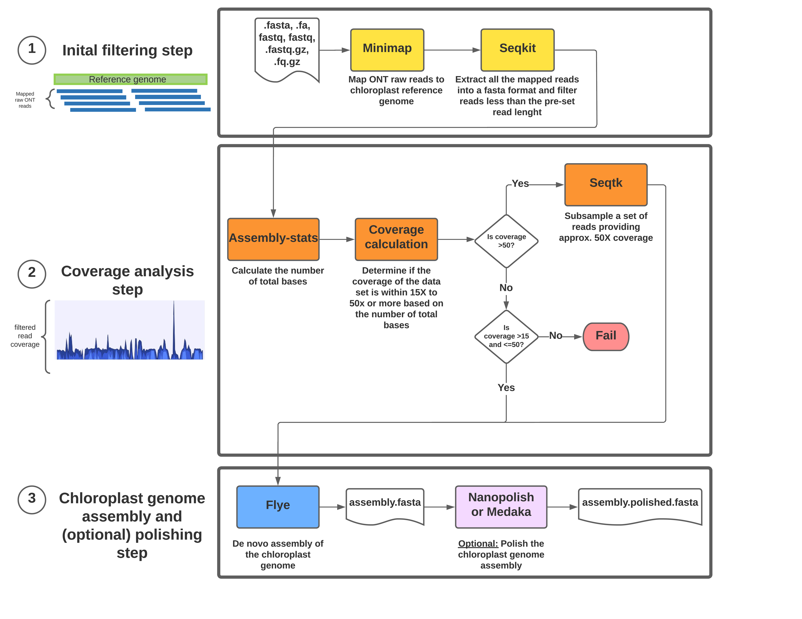

# chloroplast Genome Assembly Using Long reads data (cpgaul)

This pipeline is used for plastid genome assembly based on long reads data, including both Nanopore and PacBio. It will help assemble the cpgenome with many repeat regions and reduce the assembly path number from short reads data. Our data is not published yet [Zhou et al. (unpublished)]. We introduced this pipeline in [BAGGs workshop]().

## Prerequisites and Software/dependencies

1. [minimap2](https://github.com/lh3/minimap2) or use [conda](https://anaconda.org/bioconda/minimap2) to install.
```
check if minimap2 is installed successfully by typing "minimap2 -h" in terminal.
```

2. [seqkit](https://bioinf.shenwei.me/seqkit/) or use [conda](https://anaconda.org/bioconda/seqkit) to install.for Step2.

```
check if seqkit is installed successfully by typing "seqkit -h" in terminal.
```
3. [assembly-stats](https://github.com/sanger-pathogens/assembly-stats) or use [conda](https://anaconda.org/bioconda/assembly-stats) to install.for Step2.

```
check if assembly-stats is installed successfully by typing "assembly-stats" in terminal.
```
4. [seqtk](https://github.com/lh3/seqtk) or use [conda](https://anaconda.org/bioconda/seqtk) to install. for Step2.
 
```
check if seqtk is installed successfully by typing "seqtk" in terminal.
```
5. [flye](https://github.com/fenderglass/Flye) or use [conda](https://anaconda.org/bioconda/flye) to install. for Step2.

```
check if flye is installed successfully by typing "flye -h" in terminal.
```
6. [python3](https://www.python.org/downloads/) and its dependencies for Step3.

```
check if python3 is installed successfully by typing "python3 -h" in terminal.
```

#### Optional Software for polishing step
7. [ropebwt2](https://github.com/lh3/ropebwt2) or use [conda](https://anaconda.org/bioconda/ropebwt2) to install.
```
check if ropebwt2 is installed successfully by typing "ropebwt2 -h" in terminal.
```
8. [msbwt](https://github.com/holtjma/msbwt) or use [conda](https://anaconda.org/kbchoi/msbwt) to install.
```
check if msbwt is installed successfully by typing "msbwt -h" in terminal.
```
9. [fmlrc](https://github.com/holtjma/fmlrc) or use [conda](https://anaconda.org/bioconda/fmlrc) to install.
Use the fmlrc instead of fmlrc2.
```
check if fmlrc is installed successfully by typing "fmlrc -h" in terminal.
```

## Environment
Examples can be run on Mac and Linux.



## Quick run
The basic things that you need to run cpGAUL are 1) a cpgenome from a closely related cpgenome data and 2) longread data (works for all fasta, fastq, and fq.gz files).

  
  ```
  Example: bash cpGAUL1_0_3.sh -r [PATH]/[reference_genome]/ -l [PATH]/[long_read_data]
  ```
  
## Output


#### EXAMPLE
##### The command for the example data.
  ```bash
  bash cpGAUL_1.0.3.sh -r Beta.fasta -l SRR1980665.1 -t 8 -f 3000 
  ```
##### This script is used to find putative paralogs in 353 enrichment data. It requires two input parameters. The "-r", "-l" are required arguments.
  
  To check all parameters in cpGAUL using:
  ```bash
  bash cpGUAL.sh -h
  ```
  
##### Parameters in Detail
```bash
Usage: this script is used for ONT cp genome assembly.
cpGAUL.sh [options]
Options:
-r <MANDATORY: contigs or scaffolds in fasta format>
-l <MANDATORY: long reads in fasta/fastq/fq.gz format>
-t <number of threads, default:1>
-f <filter the long reads less than this number; default: 3000>
-h <help manu>
(base)
```

## loop runs

The following shell snippet will filter different values of long reads, every one thousand values of n from 3000 to 15000. If the N50 is very long, you can also set n greater than 20000, in order to recover the inverted repeat region of chloroplast.

```
for n in `seq 3000 1000 15000`; do
	bash cpGAUL_1.0.3.sh -r Beta.fasta -l SRR1980665.1 -t 8 -f $n
done
```

## final assembly polish using short reads data
files illumina_* are the fq.gz file of illumina reads. Change the output path directory "/PATH/msbwt".

```
gunzip -c $illumina_1r1 $illumina_1r2 $illumina_2r1 $illumina_2r2 | awk 'NR % 4 == 2' | sort | tr NT TN | ropebwt2 -LR | tr NT TN | msbwt convert /PATH/msbwt
```
Once you finished msbwt run. $N means thread number. $assembled_cp is assembled chloroplast genome from cpGAUL. Change the output path of "/PATH/fmlrc/corrected.fasta"

```
fmlrc -p $N /PATH/msbwt/comp_msbwt.npy $assembled_cp /PATH/fmlrc/corrected_cp.fasta
```

## Citation

coming soon.

If you are using fmlrc, please cite Wang, Jeremy R. and Holt, James and McMillan, Leonard and Jones, Corbin D. FMLRC: Hybrid long read error correction using an FM-index. BMC Bioinformatics, 2018. 19 (1) 50.
